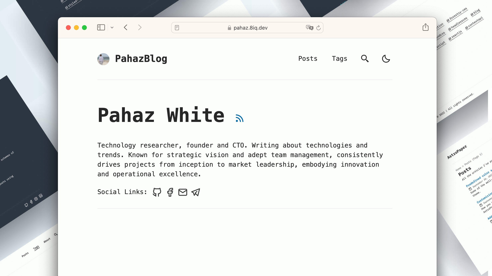

# PahazBlog 📄




[](https://conventionalcommits.org)
[](http://commitizen.github.io/cz-cli/)

PahazBlog is a minimal, responsive, accessible and SEO-friendly Astro blog theme. This theme is designed and crafted based on [pahaz personal blog](https://pahaz.8iq.dev/blog).

## 🔥 Features

- [x] type-safe markdown
- [x] super fast performance
- [x] accessible (Keyboard/VoiceOver)
- [x] responsive (mobile ~ desktops)
- [x] SEO-friendly
- [x] light & dark mode
- [x] fuzzy search
- [x] draft posts & pagination
- [x] sitemap & rss feed
- [x] followed best practices
- [x] highly customizable
- [x] dynamic OG image generation

## ✅ Lighthouse Score

<p align="center">
  <a href="https://pagespeed.web.dev/report?url=https%3A%2F%2Fpahaz.8iq.dev%2F&form_factor=desktop">
    
  <a>
</p>

## 🚀 Project Structure

Inside of AstroPaper, you'll see the following folders and files:

```bash
/
├── public/
│   └── favicon.svg
│   └── astropaper-og.jpg
│   └── toggle-theme.js
├── src/
│   ├── assets/
│   │   └── socialIcons.ts
│   ├── components/
│   ├── content/
│   │   |  blog/
│   │   |    └── some-blog-posts.md
│   │   └── config.ts
│   ├── layouts/
│   └── pages/
│   └── styles/
│   └── utils/
│   └── config.ts
│   └── types.ts
└── package.json
```

Astro looks for `.astro` or `.md` files in the `src/pages/` directory. Each page is exposed as a route based on its file name.

Any static assets, like images, can be placed in the `src/assets/` directory.

All blog posts are stored in `src/content/blog` directory.

## 📖 Documentation

Documentation can be read in two formats\_ _markdown_ & _blog post_.

- Configuration - [blog post](https://astro-paper.pages.dev/posts/how-to-configure-astropaper-theme/)
- Add Posts - [blog post](https://astro-paper.pages.dev/posts/adding-new-posts-in-astropaper-theme/)
- Customize Color Schemes - [blog post](https://astro-paper.pages.dev/posts/customizing-astropaper-theme-color-schemes/)
- Predefined Color Schemes - [blog post](https://astro-paper.pages.dev/posts/predefined-color-schemes/)

## 💻 Tech Stack

**Main Framework** - [Astro](https://astro.build/)  
**Type Checking** - [TypeScript](https://www.typescriptlang.org/)  
**Component Framework** - [ReactJS](https://reactjs.org/)  
**Styling** - [TailwindCSS](https://tailwindcss.com/)  
**UI/UX** - [Figma](https://figma.com)  
**Fuzzy Search** - [FuseJS](https://fusejs.io/)  
**Icons** - [Boxicons](https://boxicons.com/) | [Tablers](https://tabler-icons.io/)  
**Code Formatting** - [Prettier](https://prettier.io/)  
**Deployment** - [Github Pages](https://pages.github.com/)  
**Illustration in About Page** - [https://freesvgillustration.com](https://freesvgillustration.com/)  
**Linting** - [ESLint](https://eslint.org)

## 👨🏻‍💻 Running Locally

The easiest way to run this project locally is to run the following command in your desired directory.

```bash
# npm 6.x
npm create astro@latest --template satnaing/astro-paper

# npm 7+, extra double-dash is needed:
npm create astro@latest -- --template satnaing/astro-paper

# yarn
yarn create astro --template satnaing/astro-paper
```

## 🧞 Commands

All commands are run from the root of the project, from a terminal:

> **_Note!_** For `Docker` commands we must have it [installed](https://docs.docker.com/engine/install/) in your machine.

| Command                              | Action                                                                                                                           |
| :----------------------------------- | :------------------------------------------------------------------------------------------------------------------------------- |
| `npm install`                        | Installs dependencies                                                                                                            |
| `npm run dev`                        | Starts local dev server at `localhost:4321`                                                                                      |
| `npm run build`                      | Build your production site to `./dist/`                                                                                          |
| `npm run preview`                    | Preview your build locally, before deploying                                                                                     |
| `npm run format:check`               | Check code format with Prettier                                                                                                  |
| `npm run format`                     | Format codes with Prettier                                                                                                       |
| `npm run sync`                       | Generates TypeScript types for all Astro modules. [Learn more](https://docs.astro.build/en/reference/cli-reference/#astro-sync). |
| `npm run cz`                         | Commit code changes with commitizen                                                                                              |
| `npm run lint`                       | Lint with ESLint                                                                                                                 |
| `docker compose up -d`               | Run AstroPaper on docker, You can access with the same hostname and port informed on `dev` command.                              |
| `docker compose run app npm install` | You can run any command above into the docker container.                                                                         |

> **_Warning!_** Windows PowerShell users may need to install the [concurrently package](https://www.npmjs.com/package/concurrently) if they want to [run diagnostics](https://docs.astro.build/en/reference/cli-reference/#astro-check) during development (`astro check --watch & astro dev`). For more info, see [this issue](https://github.com/satnaing/astro-paper/issues/113).

## ✨ Feedback & Suggestions

If you have any suggestions/feedback, [leave an issue](https://github.com/pahaz/pahaz.8iq.dev/issues)

## 📜 License

Licensed under the MIT License, Copyright © 2024

---

Based on [AstroPaper](https://github.com/satnaing/astro-paper) and modified by [Pahaz](https://github.com/satnaing/pahaz)
